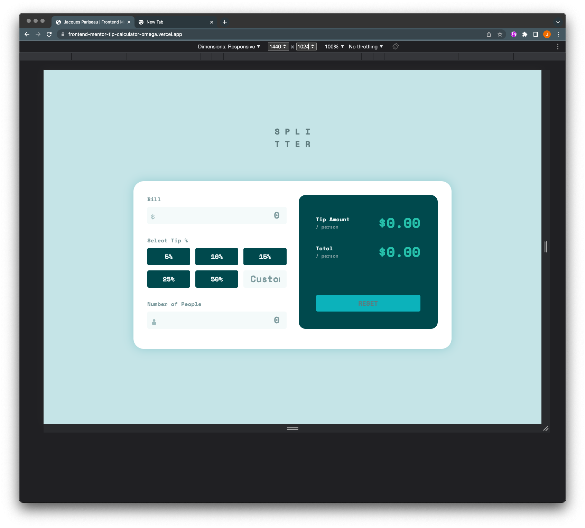

# Frontend Mentor - Tip calculator app solution

This is a solution to the [Tip calculator app challenge on Frontend Mentor](https://www.frontendmentor.io/challenges/tip-calculator-app-ugJNGbJUX). Frontend Mentor challenges help you improve your coding skills by building realistic projects.

## Table of contents

- [Overview](#overview)
  - [The challenge](#the-challenge)
  - [Screenshot](#screenshot)
  - [Links](#links)
- [My process](#my-process)
  - [Built with](#built-with)
  - [What I learned](#what-i-learned)
  - [Continued development](#continued-development)
  - [Useful resources](#useful-resources)
- [Author](#author)

## Overview

### The challenge

Users should be able to:

- View the optimal layout for the app depending on their device's screen size
- See hover states for all interactive elements on the page
- Calculate the correct tip and total cost of the bill per person

### Screenshot

### Links

- [Live Site](https://frontend-mentor-tip-calculator-omega.vercel.app/)
- [Frontend Mentor Solution](https://www.frontendmentor.io/solutions/responsive-tip-calculator-with-vanilla-js-and-css-ziYZ3zbj_m)
- [Frontend Mentor Challenge](https://www.frontendmentor.io/challenges/tip-calculator-app-ugJNGbJUX)

## My process

### Built with

- Semantic HTML5 markup
- CSS custom properties
- Flexbox
- CSS Grid
- Mobile-first workflow

### What I learned

This challenge was kind of difficult for me, as it was the first time I was dealing with a live-updating form, which required a lot of thinking about event handlers.

I was initially putting event handlers on each of the individual form elements (inputs for bill and people and the tip buttons and custom tip input), but I ended up going away from this idea in favor of global scope event listeners on the document with conditionals for the target. This ended up simplifying the code significantly.

This was also the first time that I used simple, global-scope variables for handling the button clicks/active states, the data for caluclating the results, the results themselves, and the errors. I think this makes my code much more readable than trying to do everything in very complex functions.

I tried to eschew duplication whenever possible, breaking repeatable parts of my code into their own separate functions, leading to more named functions in the app (9 total), but overall fewer lines of code and less redundancy.

I also handled the errors differently here, using toggle-able classes instead of hard-coding the styles via DOM manipulation, which also simplified things.

### Continued development

With each of these challenges, I'm learning a lot about organizing my code and best practices for simplifying things.

From this project, I will definitely continue using classes for error handling instead of JS style setting, and I think I will continue using the globally-scoped variables for handling validation, error handling, etc.

### Useful resources

- [CSS Grid Guide](https://css-tricks.com/snippets/css/complete-guide-grid/) - I've never really used CSS grid before, so I was very unfamiliar with its syntax (which is confusingly quite close to that of Flexbox). Using this resource, though, I was able to make my app work very well and style it incredibly closely to the design file I was given.
- [CSS Flexbox Guide](https://css-tricks.com/snippets/css/a-guide-to-flexbox/) - From the same people as above, gives a great breakdown of all Flexbox properties and is something that I reference to ensure responsiveness.

## Author

- Website - [Jacques Pariseau](https://www.your-site.com)
- Frontend Mentor - [@jacqueschuis](https://www.frontendmentor.io/profile/jacqueschuis)
